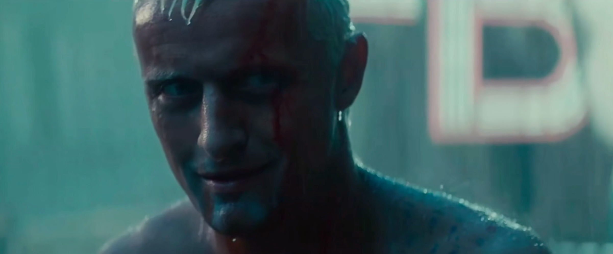
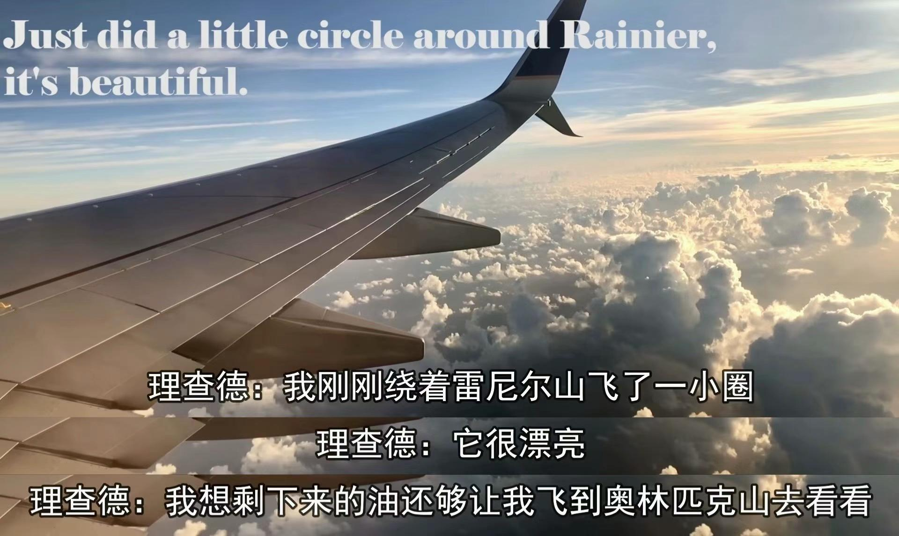
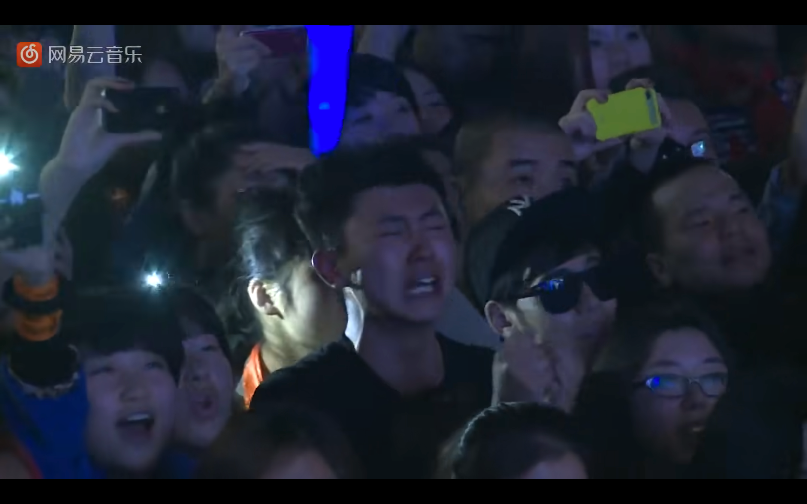
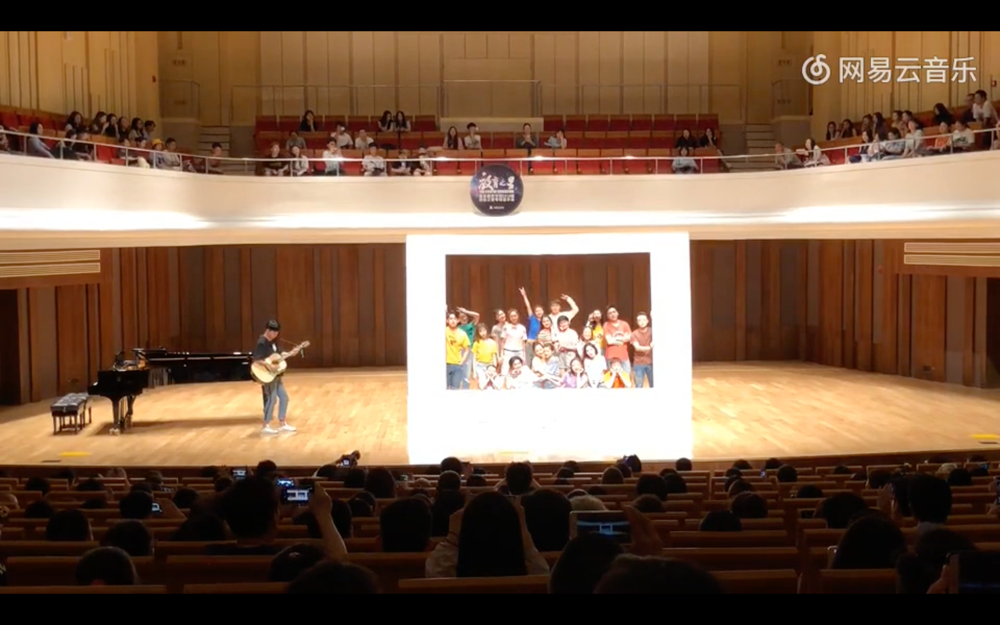

<!--
 * @Author: Mr.Car
 * @Date: 2025-08-27 22:07:10
-->
## 死亡

1. 对死亡的恐惧是人的本能。
2. 人一出生就会奔赴死亡，对死亡的恐惧如影随形。不细思则已，细思便如凝视深渊，被恐惧吞噬。

> 银翼杀手：I've seen things you people wouldn't believe.Attack ships on fire off the shoulder of Orion.I've watched c-beams glitter in the dark near the Tannhauser Gate.All those ... moments will be lost in time, like tears...in rain.

[link](https://www.bilibili.com/video/BV1yx411E79x/?spm_id_from=333.337.search-card.all.click&vd_source=22168b0f459314889690fd66b036d155)

## 孤独

1. 人生天地间，忽如他乡客；
2. 父母在，人生尚有来处，父母去，人生只剩归途；
3. 每个人都是一座孤岛，心有千言重如山，吐纳之间，只能说出寥寥数字，自己都无法完整窥视自己的内心，如何奢求让别人理解？

[link](https://www.bilibili.com/video/BV1XH4y1c7kD/?spm_id_from=333.337.search-card.all.click&vd_source=22168b0f459314889690fd66b036d155)

## 落差

1. 理想与现实的落差: 
2. 诗人:面朝大海，春暖花开 (海子)
4. 李B:[这个世界会好吗？](B.mp3)

[link](https://www.bilibili.com/video/BV1uW411q7Zp/?spm_id_from=333.337.search-card.all.click&vd_source=22168b0f459314889690fd66b036d155)

## 古老的问题对应着古老的答案

> 如果没有死亡，沧海桑田还会美吗？

> 人固有一死，或重于泰山，或轻于鸿毛，用之所趋异也。

> 每一个不曾起舞的日子都是对生命的辜负。

> 人最宝贵的是生命，生命每个人只有一次。人的一生应当这样度过：当回忆往事的时候，他不会因为虚度年华而悔恨，也不会因为碌碌无为而羞耻；

>  壬戌之秋，七月既望，苏子与客泛舟游于赤壁之下。清风徐来，水波不兴。举酒属客，诵明月之诗，歌窈窕之章。少焉，月出于东山之上，徘徊于斗牛之间。白露横江，水光接天。纵一苇之所如，凌万顷之茫然。浩浩乎如冯虚御风，而不知其所止；飘飘乎如遗世独立，羽化而登仙。
>　 于是饮酒乐甚，扣舷而歌之。歌曰：“桂棹兮兰桨，击空明兮溯流光。渺渺兮予怀，望美人兮天一方。”客有吹洞箫者，倚歌而和之。其声呜呜然，如怨如慕，如泣如诉；余音袅袅，不绝如缕。舞幽壑之潜蛟，泣孤舟之嫠妇。
>   苏子愀然，正襟危坐而问客曰：“何为其然也？”客曰：“‘月明星稀，乌鹊南飞’，此非曹孟德之诗乎？西望夏口，东望武昌，山川相缪，郁乎苍苍，此非孟德之困于周郎者乎？方其破荆州，下江陵，顺流而东也，舳舻千里，旌旗蔽空，酾酒临江，横槊赋诗，固一世之雄也，而今安在哉？况吾与子渔樵于江渚之上，侣鱼虾而友麋鹿，驾一叶之扁舟，举匏樽以相属。寄蜉蝣于天地，渺沧海之一粟。哀吾生之须臾，羡长江之无穷。挟飞仙以遨游，抱明月而长终。知不可乎骤得，托遗响于悲风。”
>    苏子曰：“客亦知夫水与月乎？逝者如斯，而未尝往也；盈虚者如彼，而卒莫消长也。盖将自其变者而观之，则天地曾不能以一瞬；自其不变者而观之，则物与我皆无尽也，而又何羡乎！且夫天地之间，物各有主，苟非吾之所有，虽一毫而莫取。惟江上之清风，与山间之明月，耳得之而为声，目遇之而成色，取之无禁，用之不竭。是造物者之无尽藏也，而吾与子之所共适。"
>   客喜而笑，洗盏更酌。肴核既尽，杯盘狼籍。相与枕藉乎舟中，不知东方之既白。

## Philosophy of mine

1. 理解掌握知识，强健体魄带来的满足
2. 师生情，亲情，友情，爱情，对内心的充盈
3. 接受自己的人生是一条平凡之路，随之而来的释然

[link](https://www.bilibili.com/video/BV1wt411q7R5/?spm_id_from=333.337.search-card.all.click)

## A Quiz

如果你是诺亚方舟唯一的乘客，只能带上一张信封大小的纸上船，你会在纸上写什么，留给未来的新人类？

[reference answer](https://www.zhihu.com/people/dang-ge-30-49)

我母亲送给我的4个字: `拼命活着`
我父亲送给我的4个字: `志存高远`
我自己感悟出来的4个字：`相信自己`

## 如何提升自己？

> 现在我意识到“哲学家的上帝”和“佛法大义”本质上并无区别，都在试图解释生命意义的答案；人为什么要活着？这个答案本身应该很简单，但是想要深刻体会却相当复杂，我隐隐意识到：人活着的意义和一只蚂蚁活着的意义没有区别，珍惜当下应该做的事情，去经历低级的欲望，再去探求高级的欲望，用力生活，不留遗憾；

## 推荐书籍

1. 永恒的终结
2. 禅与摩托车维修艺术
3. 悉达多
3. Personal Development for smart people